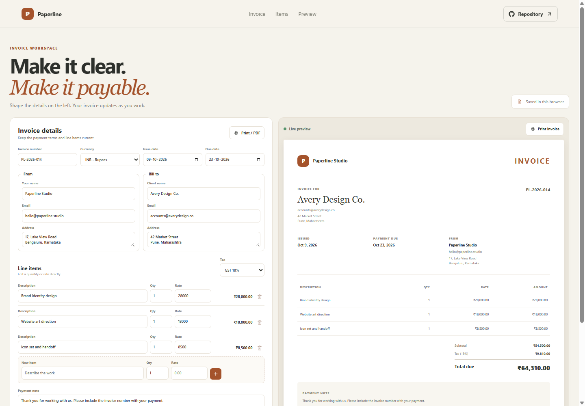

# Paperline Invoice Builder

Paperline gives freelancers and small studios a simple workspace to edit invoice details, add billable work, calculate tax, and print a clean invoice.

## What it includes

- Editable invoice number, issue date, due date, currency, sender, and client details.
- Line items with description, quantity, and rate.
- Live subtotal, configurable GST, and total due.
- Live document preview with a print and Save as PDF action.
- A custom confirmation dialog before a line item is removed.
- Automatic saving to this browser's local storage.

## How to use it

Edit the document and contact fields, then update the existing line items or add another one. Choose a currency and a tax rate from the selectors. The preview and totals update as the values change. Select Print invoice or Print / PDF and choose a printer or Save as PDF in the browser print dialog.

## Saving and data

The current invoice is saved in local storage in this browser. It is not sent to a server and is not synced across devices. Use the browser print dialog to create a PDF copy. Tax rates are simple percentage calculations and do not determine which tax rate applies to a real transaction.

## Run locally

Run npm install to install dependencies, npm run dev to start the local server, npm run lint and npm run build to check the project, and npm run deploy to publish it to GitHub Pages.

Planned URL after deployment: https://a2rp.github.io/invoice-builder/

## Future improvements

Ideas that are not implemented yet: multiple saved invoice drafts, company logo upload, and payment status tracking.

## Links

- Portfolio: [https://www.ashishranjan.net](https://www.ashishranjan.net)
- GitHub: [https://github.com/a2rp](https://github.com/a2rp)
- CodePen: [https://codepen.io/ash1198](https://codepen.io/ash1198)
- LinkedIn: [https://www.linkedin.com/in/aashishranjan](https://www.linkedin.com/in/aashishranjan)
- Facebook: [https://www.facebook.com/theash.ashish/](https://www.facebook.com/theash.ashish/)
- YouTube: [https://www.youtube.com/@ashishranjan-ashz?sub_confirmation=1](https://www.youtube.com/@ashishranjan-ashz?sub_confirmation=1)
- Email: [mailto:ash.ranjan09@gmail.com](mailto:ash.ranjan09@gmail.com)

## Support

- Support: [https://a2rp-donation-page.netlify.app/](https://a2rp-donation-page.netlify.app/)
- Buy Me a Coffee: [https://buymeacoffee.com/ashishranjan](https://buymeacoffee.com/ashishranjan)
- Patreon: [https://www.patreon.com/ashishranjan](https://www.patreon.com/ashishranjan)